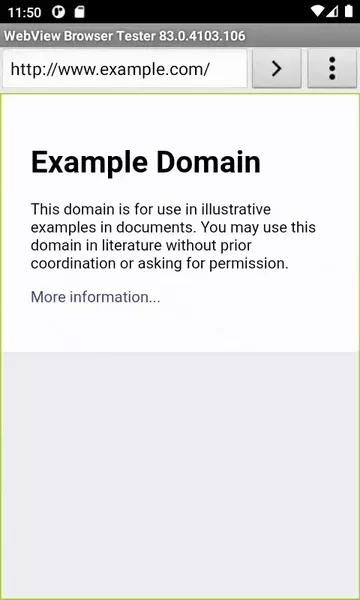

# QSeek

QSeek은 선택한 텍스트를 사전 등의 웹 서비스에서 바로 검색하는 기능을 제공하는 앱입니다.

이 앱은 개인적인 용도로 사용하려고 제작하였습니다.

## 사용 가능한 웹 서비스

- 캠브리지 영영사전
- 메리엄-웹스터 영영사전
- 네이버 사전
- 다음 사전
- 사용자 지정 URL도 쓸 수 있어요! (주의: WebView에 JavaScript가 꺼져있습니다)
